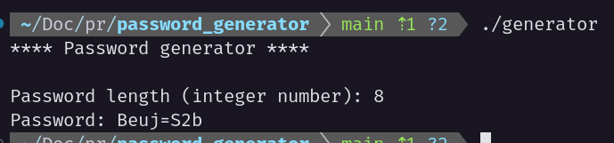

### Simple Password Generator

This application generates a strong password, containing lower and upper case letters, symbols and numbers. 

#### How to run
##### Cloning the repo
```bash
    git clone https://github.com/hitalloazevedo/password-generator
```
```bash
    cd password-generator
```

##### Compiling
```bash
    gcc generator.c -o generator
```

##### Running
```bash
    ./generator
```

##### Usage
Enter the password length (integer), the length must be greater than 4.

